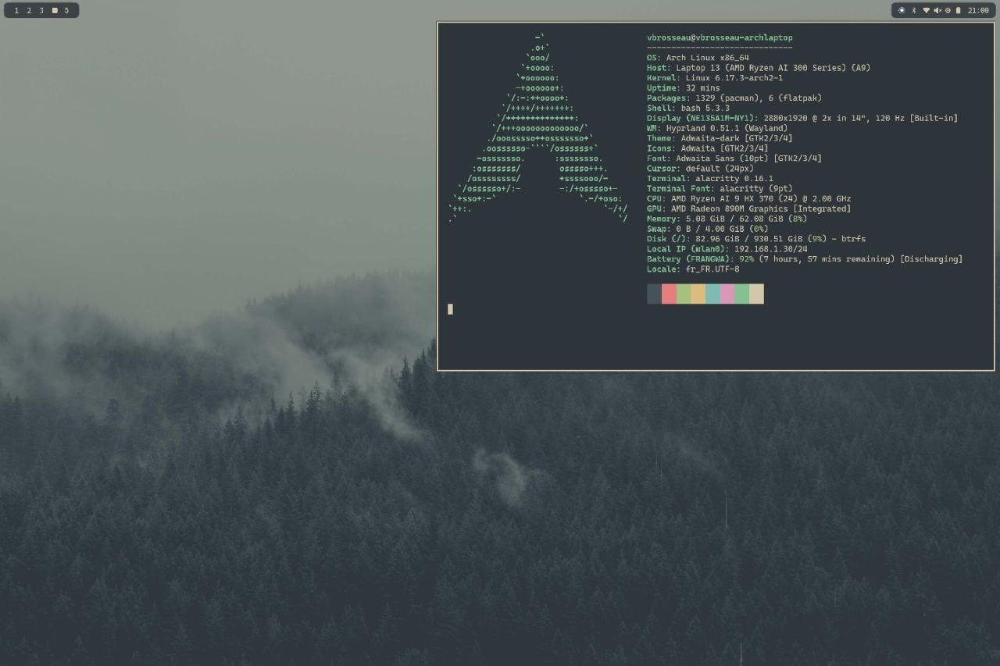

# Dotarchy

This repository contains installation and configuration scripts for Arch Linux and macOS. The goal is to automate the setup of applications, fonts, development tools, and user configurations.



⚠️ The Niri setup is massively extracted/inspired from the excellent [Omarchy project](https://omarchy.org/) by [@dhh](https://github.com/dhh).
[Niri Keybindings reference](./archlinux/install/tilling/README.md)

[Documentation](https://c4software.github.io/dotarchy/)

## Prerequisites

- Sudo access on the machine.
- Internet connection.

## Usage

1. Clone the repository:

```bash
clear
echo -e "\nCloning dotarchy repository..."
git clone https://github.com/c4software/dotarchy.git ~/dotarchy
cd ~/dotarchy

./setup.sh
```

This script detects your distribution (`pacman` → Arch, `$OSTYPE == darwin` → macOS) and launches the appropriate setup process.

### Update configuration files only

To update only the configuration files without installing packages, you can run `update.sh`:

```bash
./update.sh
```

⚠️ This will overwrite your existing configuration files. Make sure to back up any important configurations before running this command.
⚠️ This will not update all [common configuration](./common/) files, only those related to Niri. To **update all configuration files**, please use `update.sh --all`.

### AMD AI 9 HX 370 Series CPU users

You can reduce the power consumpution of your CPU by enabling AMD P-State and forcing PCIe ASPM.

Edit the bootloader entries in `/boot/loader/entries/<your-arch-entry>.conf` and add the following line:

```
amd_pstate=active pcie_aspm=force
```

### Dotarchy doctor

You can run `./dotarchy-doctor.sh` to check if your current setup is correct and if all necessary components are installed.

### Keybindings reference

[Keybindings reference](./install/tilling/README.md)

## Main Structure

- `setup.sh`: Entry script that loads the common bootstrap and selects the distribution.
- `macos/`: Scripts and subfolders for macOS.
- `archlinux/`: Scripts and subfolders for Arch Linux.
- `common/`: Shared scripts (e.g., webapp installation, config bootstrap).
- Each distribution contains an `install/` folder with:
  - `apps/`: CLI applications and tools installation.
  - `desktop/`: Desktop environment apps and fonts.
  - `tilling/`, `config/`, etc. depending on the distribution.

## Customization

- Add or edit scripts in `install/apps/` or `install/desktop/` to extend the configuration.
- User configuration files are copied from `../config/` by the bootstrap — modify these sources to change deployed configs.
- Provided binaries/scripts are copied to `~/.local/bin` via `common/install/bootstrap.sh`.

## Installed Software

### Terminal Applications

- **btop**: A resource monitor that shows usage and stats for processors, memory, disks, network, and processes.
- **htop**: An interactive process viewer for Unix systems.
- **fastfetch**: A tool for fetching system information and displaying it in a pretty way.
- **fd**: A simple, fast, and user-friendly alternative to `find`.
- **fzf**: A command-line fuzzy finder.
- **ripgrep**: A line-oriented search tool that recursively searches the current directory for a regex pattern.
- **zoxide**: A smarter `cd` command that learns your habits.
- **eza**: A modern replacement for `ls` written in Rust.
- **bat**: A `cat` clone with syntax highlighting and Git integration.
- **jq**: A lightweight and flexible command-line JSON processor.
- **xmlstarlet**: A command-line XML toolkit.
- **zip/unzip**: Utilities for compressing and decompressing files.
- **curl/wget**: Tools for transferring data from or to a server.
- **unrar**: A utility for extracting files from RAR archives.
- **lazygit**: A simple terminal UI for git commands.
- **lazydocker**: A simple terminal UI for docker and docker-compose.
- **gum**: A tool for glamorous shell scripts.
- **ncdu**: A disk usage analyzer with an ncurses interface.
- **Starship**: A minimal, blazing-fast, and extremely customizable prompt for any shell. [https://starship.rs/](https://starship.rs/)

### Desktop Applications

- **Neovim**: A hyper-extensible, Vim-based text editor. It is configured with **LazyVim**.
- **Visual Studio Code**: A source-code editor developed by Microsoft.
- **Docker**: A platform for developing, shipping, and running applications in containers.
- **Google Chrome**: A cross-platform web browser.
- **k9s**: A terminal-based UI to manage Kubernetes clusters.
- **ProtonVPN**: A VPN service.
- **Signal**: A cross-platform centralized encrypted messaging service.
- **Ghostty**: A terminal-based UI.
- **Snapper**: A tool for managing Btrfs snapshots.
- **CUPS**: A printing system for Unix-like operating systems.

### Development Tools

- **Mise**: A tool for managing multiple runtime versions.
- **luarocks**: A package manager for Lua modules.
- **tree-sitter-cli**: A command-line tool for parsing source code.

### Fonts

- **Font Awesome**
- **Cascadia Code**
- **iA Writer**
- **Google Noto Fonts (Sans, Emoji, CJK, and Extra)**
- **JetBrains Mono**

## Contributing

- Add your script to the relevant distribution folder.
- Open a pull request with a clear description of what your script installs and why.
