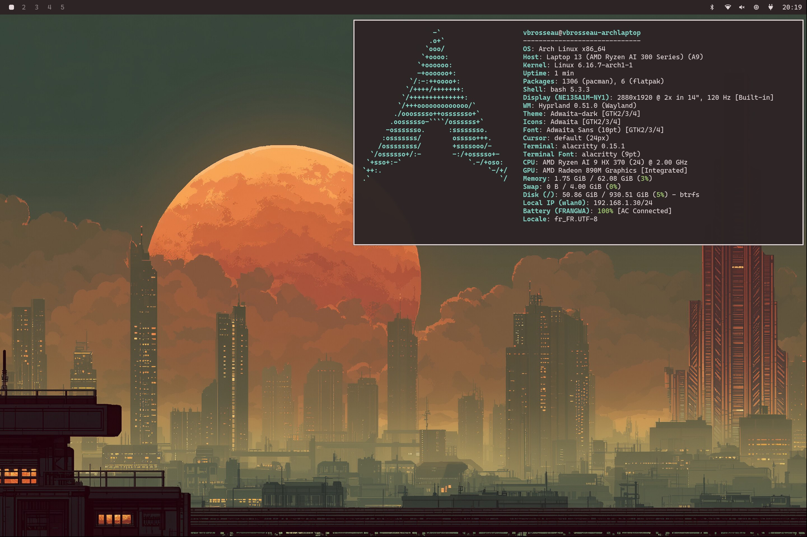

# Hyprland - Keyboard Shortcuts

### Window Management

| Shortcut | Description |
| :--- | :--- |
| `SUPER + W` | Close the active window |
| `SUPER + J` | Toggle "split" (division) |
| `SUPER + P` | "Pseudo" window |
| `SUPER + V` | Toggle floating mode |
| `SHIFT + F11` | Force fullscreen |
| `SUPER + ALT +  ↑/↓` | Toggle monocle mode (fullscreen with background window management) |
| `SUPER + ←/→/↑/↓` | Move focus |
| `SUPER + [0-9]` | Switch to workspace |
| `SUPER + SHIFT + [0-9]` | Move window to workspace |
| `SUPER + TAB` | Next workspace |
| `SUPER + SHIFT + TAB` | Previous workspace |
| `SUPER + SHIFT + ←/→/↑/↓` | Swap active window with neighbor |
| `ALT + Tab` | Next window in workspace |
| `ALT + SHIFT + Tab` | Previous window in workspace |
| `SUPER + -/=` | Resize window horizontally |
| `SUPER + SHIFT + -/=` | Resize window vertically |
| `ALT + ←/→/↑/↓` | Resize window horizontally/vertically |
| `SUPER + Mouse wheel` | Scroll through workspaces |
| `SUPER + Left click` | Move window |
| `SUPER + Right click` | Resize window |

---

### Applications

| Shortcut | Description |
| :--- | :--- |
| `SUPER + Enter` | Launch terminal |
| `SUPER + F` | Launch file manager |
| `SUPER + B` | Launch browser |
| `SUPER + N` | Launch Neovim |
| `SUPER + T` | Launch `btop` (activity monitor) |
| `SUPER + D` | Launch `lazydocker` |
| `SUPER + C` | Launch AI menu |
| `SUPER + SHIFT + G` | Launch WhatsApp |
| `SUPER + ALT + G` | Launch Google Messages |

---

### Utilities

| Shortcut | Description |
| :--- | :--- |
| `SUPER + Space` | Launch application menu (`walker`) |
| `SUPER + CTRL + E` | Show clipboard (`walker` Emojis) |
| `SUPER + ALT + Space` | Omarchy menu |
| `SUPER + ESC` or `XF86PowerOff` | Power menu |
| `SUPER + K` | Show keyboard shortcuts |
| `SUPER + SHIFT + Space` | Show/hide top bar (`waybar`) |
| `SUPER + CTRL + Space` | Next wallpaper in theme |
| `SUPER + SHIFT + CTRL + Space` | Choose a new theme |
| `SUPER + ,` | Dismiss last notification |
| `SUPER + SHIFT + ,` | Dismiss all notifications |
| `SUPER + CTRL + ,` | Toggle silent mode for notifications |
| `SUPER + CTRL + I` | Toggle lock on inactivity |
| `Print Screen` | Screenshot menu |
| `SUPER + SHIFT + 4` | Screenshot menu |
| `SUPER + Print Screen` | Color picker (`hyprpicker`) |

---

### Media

| Shortcut | Description |
| :--- | :--- |
| `XF86AudioRaiseVolume` | Increase volume |
| `XF86AudioLowerVolume` | Decrease volume |
| `XF86AudioMute` | Mute/unmute sound |
| `XF86AudioMicMute` | Mute/unmute microphone |
| `XF86MonBrightnessUp` | Increase brightness |
| `XF86MonBrightnessDown` | Decrease brightness |
| `ALT + XF86AudioRaiseVolume` | Increase volume (precise) |
| `ALT + XF86AudioLowerVolume` | Decrease volume (precise) |
| `ALT + XF86MonBrightnessUp` | Increase brightness (precise) |
| `ALT + XF86MonBrightnessDown` | Decrease brightness (precise) |
| `XF86AudioNext` | Next track |
| `XF86AudioPause` / `XF86AudioPlay` | Play/pause |
| `XF86AudioPrev` | Previous track |

